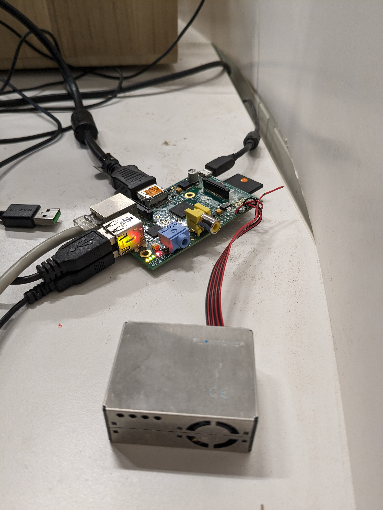
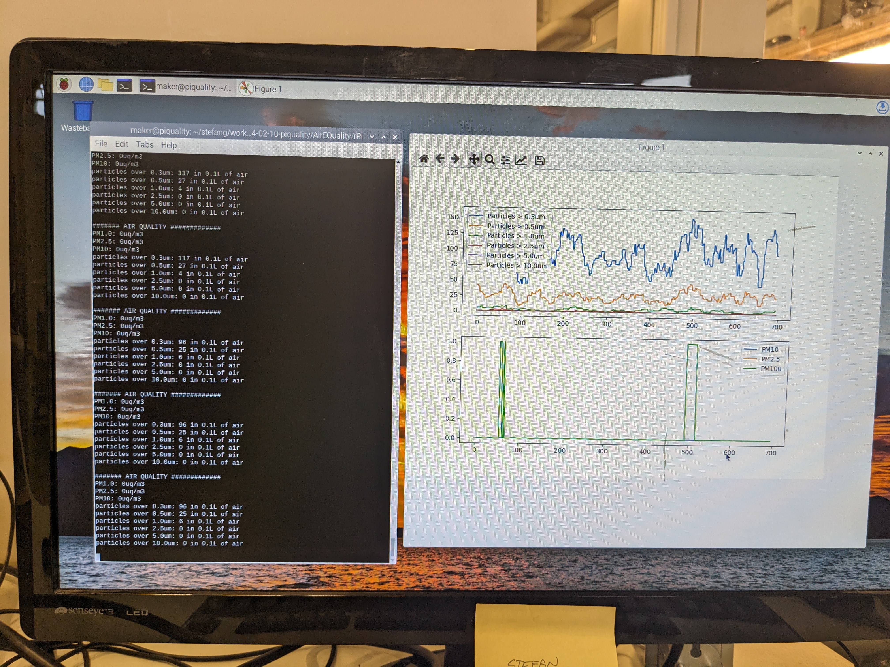

# Air Quality Monitor running on rPi 1

I found an old (2011) original Raspberry Pi v1 and decided to hook up the PM2.5 Air Quality Sensor to that.

This directory contains the Python code used to read, store and display the data from the PM2.5 sensor.

